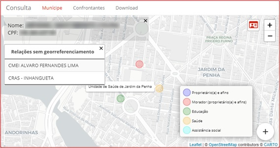

[](https://sonarcloud.io/summary/new_code?id=consulta)

<h1 align="center">Consulta</h1>
<p align="center"></p> 


## Descrição e contexto
---
O "Consulta" é uma ferramenta que tem o objetivo de apresentar todas as informações presentes na base de dados da Prefeitura sobre um determinado munícipe a partir de um único <i>dashboard</i>, revelando as relações mantidas por este com a gestão municipal de uma forma visual, prática e intuitiva. A aplicação foi elaborada como uma prova de conceito de uso de dados disponíveis para resolução de problemas urbanos no âmbito da Cooperação Técnica BR-T1496 - Potencializando o uso de Soluções de Big Data para Cidades Inteligentes.

## Guia do usuário
---

O Consulta é acessado através de uma interface única intuitiva, a partir da qual cada módulo pode ser selecionado.

### Módulo "Munícipe"

O módulo "Munícipe" permite ao usuário pesquisar por qualquer pessoa presente na base de dados da prefeitura através do nome ou CPF. A partir da pesquisa, são exibidas as informações georreferenciadas das relações mantidas com a prefeitura. Uma lista das relações que não possuem dados georreferenciados (quando for o caso) complementa a exposição em uma tabela flutuante. Além da percepção visual das relações com a prefeitura, as informações pessoais do munícipe e dos imóveis com ele relacionados são oferecidas ao usuário a partir da seleção de pontos do mapa com cliques do mouse.

### Módulo "Confrontantes"

O módulo "Confrontantes" permite ao usuário identificar os munícipes que se relacionam com cada lote da cidade. A partir da seleção de algum munícipe em específico, o usuário é remetido novamente ao módulo "Munícipe" para a visualização de maiores detalhes do mesmo.

### Módulo "Download"

O módulo "Confrontantes" permite ao usuário fazer uma consulta em lote dos munícipes por meio do upload de um arquivo .txt contendo uma lista de CPFs desejados. Em seguida, o usuário deve indicar quais informações ele deseja obter (atualmente, estão disponíveis as informações de telefone, e-mail, endereço e inscrições cadastrais). Ao pressionar o botão “download” e esperar alguns segundos, a transferência das informações é iniciada. Como resultado, o usuário obtém um arquivo xlsx contendo uma única planilha eletrônica onde, em cada linha, são apresentadas as informações para cada munícipe indicado.

### Modo administrador

Para os usuários que possuem a atribuição de administrador, um botão flutuante no canto inferior direito dá acesso ao “modo administrador”. Nesse módulo, o usuário poderá realizar todas as atribuições de manutenção de usuários (criação e exclusão, modificação, alteração de senha, etc.). Além disso, na aba conexões, é possível acompanhar a quantidade de acessos realizada por cada usuário, além do período em que tal acesso foi registrado.

## Guia de instalação
---

A implementação da aplicação requer cinco passos:

* Personalização do código;
* Preparação dos dados;
* Execução inicial;
* Implantação do ambiente de visualização;
* Configuração da atualização automática.

### Personalização do código

Pontos fundamentais:

- Clonar o repositório;

- Alterar o arquivo config.R para se adequar ao ambiente desejado.

Observações adicionais:

Para compreender a necessidade de alteração do código, é preciso entender que o mesmo encontra-se dividido em três "fatias" - coleta, manipulação e visualização - cada uma presente em seu próprio diretório.

A "coleta" é responsável por obter todos os dados necessários para a aplicação, tanto os provenientes de bases externas (dados do OpenStreetMaps) quantos os fornecidos pela prefeitura. A necessidade de alteração dos códigos presentes nesta etapa resultam tanto das peculiaridades de acesso aos dados internos quanto da inclusão de novas bases externas.

Na fatia "manipulação" estão presentes a preparação das variáveis para a adequada exibição: cruzamento das informações sobre o munícipe proveniente das diversas bases da prefeitura e georreferenciamento de suas relações. Uma vez que seja respeitada a estrutuda dos dados de entrada, modificações só serão necessárias para a inclusão de novas funcionalidades.

A "visualização" consiste no aplicativo em Shiny que permite o acesso do usuário às informações levantadas.

### Preparação dos dados

Os dados fornecidos pela prefeitura devem ser adequados aos requisitos da aplicação. Na pasta "dados" encontram-se os modelos de dados necessários:

- modelo_dw.xlsx
- imoveis.kml
- lotes.kml
- unidades.kml
- unidades_saude.kml

O arquivo modelo_dw.xlsx contém uma pasta do excel onde cada planilha apresenta uma tabela do Datawarehouse da prefeitura. É preciso configurar um acesso ODBC via DSN. O DSN para conexão via ODBC pode ser personalizado no arquivo "config.R". Caso se deseje modificar a forma de acesso a esse conjunto de dados, basta alterar o código do arquivo "coleta/dw_via_odbc.R".

Novas bases de dados podem ser facilmente incluídas via DW, bastando informar no dicionário de dados (arquivo "dados/dicionario.csv") a estrutura da nova base, para a realização dos cruzamentos das informações.

Além dos dados do datawarehouse, é preciso fornecer informações as localizações georreferenciadas dos imóveis do município e das unidades de atendimento da prefeitura (saúde, educação e assistência social), além das malhas dos lotes da cidade. Exemplos de arquivos com essas informações também estão presentes na pasta "dados" (lotes.kml, imoveis.kml, unidades.kml e unidades_saude.kml - esses nomes podem ser personalizados no arquivo "config.R"). Todos os imóveis que não tiverem localização georreferenciada serão localizados a partir dos dados fornecidos pela consulta dos endereços constantes no DW ao serviço do OpenStreetMap. É importante ter em mente que, como há o limite de uma solicitação por segundo, o tempo de demora para a utilização desse serviço é elevado.

### Executar o script de carga

Após a personalização do código e preparação dos dados, a aplicação deve ser executada no R uma primeira vez a partir do arquivo "iniciar.R". Esse arquivo irá instalar todas as bibliotecas necessárias e executar as duas fatias da aplicação, terminando com a atualização da fatia de visualização.

### Implantar o ambiente de visualização em um servidor

A implantação da aplicação em um servidor pode ser feita de três formas distintas:

- Via shiny-server:

Após a correta configuração do shiny-server, um link deve ser feito dentro de /srv/shiny-server apontando para a pasta "visualizacao" da aplicação. O nome do link será utilizado para acessar a aplicação pelo navegador (http://exemplo.com/nome_do_link/). 

Além disso, é preciso instalar todos os pacotes requeridos - executando o seguinte comando no servidor:

`sudo su - c "R -e \"source('<CAMINHO DA APLICAÇÃO>/pacotes.R')\""`

- Via RStudio connect:
Não documentado.

- Via shinyapps.io ou serviço similar:
Não documentado.

### Configurar ferramenta de atualização automática

A atualização automática pode ser implementada criando-se um agendamento de tarefa que execute o script de carga pelo R (./carga.R). Os dados são atualizados e a aplicação de visualização no shiny-server é reiniciada em alguns instantes.

Exemplo de código para execução do script no Windows:

```
cd <CAMINHO DA APLICAÇÃO>
For /F "Skip=1 Tokens=2*" %%A In (
    'Reg Query "HKLM\SOFTWARE\R-core\R"^
    /V "InstallPath"2^>Nul'
) Do start "" "%%~B\bin\Rscript.exe" "<CAMINHO DA APLICAÇÃO>/carga.R"
```

### Dependências

A aplicação foi desenvolvida para acessar um Datawarehouse hospedado em um MS SQL Server. No entanto, deve funcionar adequadamente em qualquer base de dados que permita acesso via ODBC.

## Autor
---
[Rodrigo Franklin](mailto:rodrigo.franklin@ufes.br "e-mail")

## Colaborador
---
[Everlam Elias Montibeler](mailto:everlam.elias@ufes.br "e-mail")

## Licença 
---

A documentação de suporte e uso do software está licenciada sob a Creative Commons IGO 3.0 Attribution-NonCommercial-NoDerivative (CC-IGO 3.0 BY-NC-ND).

O código fonte deste repositório utiliza a [AM-331-A3 Software License](LICENSE.md).

## Isenção de responsabilidade

O BID não será responsável, em hipótese alguma, por danos ou indenizações, morais ou patrimoniais; direto ou indireto; acessório ou especial; ou por consequência, prevista ou imprevista, que possa surgir:

i. Sob qualquer teoria de responsabilidade, seja em contrato, violação de direitos de propriedade intelectual, negligência, ou sob qualquer outra teoria; 

ii. Como resultado do uso da Ferramenta Digital, incluindo, mas não limitado a, possíveis defeitos na Ferramenta Digital, ou perda ou imprecisão de dados de qualquer tipo. O anterior inclui despesas ou danos associados a falhas de comunicação e/ou mau funcionamento do computador, vinculados ao uso da Ferramenta Digital.
